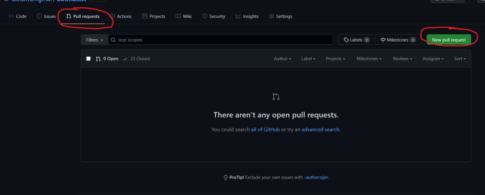
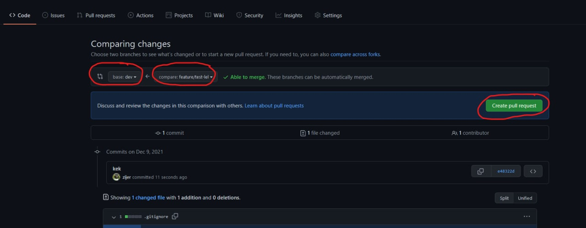
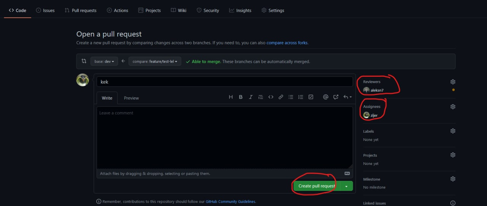

# GotBit git guide

## Начало работы:
### Переключаемся на dev ветку:
* `git switch dev`
* `git status -uno (чтобы посмотреть статус текущей ветки)`
### Получаем все изменения с сервера для текущей ветки
* `git pull`
### Переключаемся на новую ветку, отпочковываясь от dev:
* `git switch -c feature/название`
### После каждого набора изменений пишем
* `git add .`
* `git commit -m "описание изменений"`
### Чтобы отправить изменения на сервер:
* `git push -u origin feature/название (при самом первом push)`
* `git push (при всех последующих push)`

  

## После того, как работа закончена, надо создать пул реквест в dev:

### На сайте github переходим на вкладку `Pull requests` и нажимаем `New pull request`

### Справа выбираем ветку `dev`, а слева вашу ветку `(feature/название)`, и нажимаем `Create pull request`

### В `reviewer` выбираем того, `кто будет проверять ваши изменения`, а в `assignees` выбираем `себя`, и нажимаем `Create pull request.`
